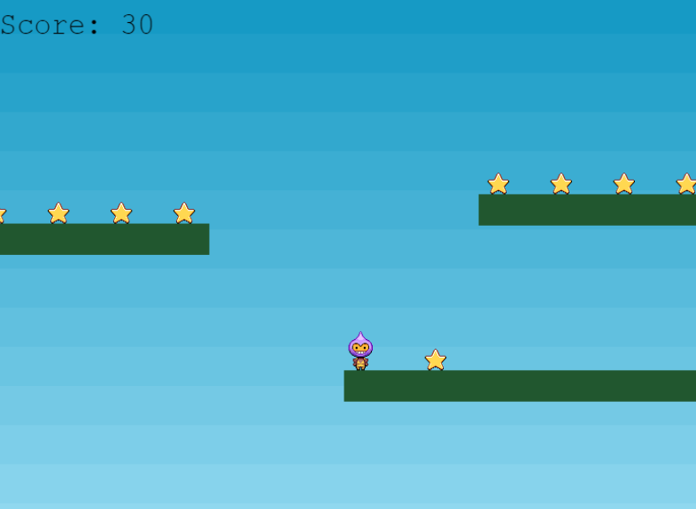

# phaser3-RPG game
In this project, I have built a browser game using the phaser game engine. Phaser is an HTML5 game framework that aims to help developers make powerful, cross-browser HTML5 games really quickly. It's a Microverse capstone project, and this time I was required to create a game to put into practice the ES6, Webpack, promises, JSON data, and functional programming. Users can play this game in the browser by using keyboard arrow keys.




## Getting Started

Follow this [link](https://wonderful-yalow-9a6269.netlify.app/) to play this game in your browser

## Setup

To get started, you should first get this file in your local machine by cloning or forking this project or typing in your terminal

```
  git clone https://github.com/elisha2kyakpo1/phaser3-game.git

  cd phaser3-game

  npm install webpack webpack-cli --save-dev

  npm install

  Just run the command below for webpack to compile the code.

  npx webpack --watch
```

## To run the game
```
Open index.html which is in dist folder

Follow screen display instructions to play the game.
```

## Contributing

Contributions, issues and feature requests are welcome! Start by:

Forking the project

Cloning the project to your local machine

cd into the project directory

```
 cd phaser3-game

 Run git checkout -b your-branch-name
```

Make your contributions

Push your branch up to your forked repository

Open a Pull Request with a detailed description to the development branch of the original project for a review

---

Built With

This project was built using these technologies.

```
Javascript

Webpack

Phaser

HTML/CSS

ESlint

VSCode editor

Git

Github
```

## Contributors

## Elisha Kyakopo

  Linkedin: [Elisha Kyakopo](https://www.linkedin.com/in/elisha-kyakopo/)

  Github: [@elisha2kyakpo1](https://github.com/elisha2kyakpo1)

  Twitter: [@elisha1k](https://twitter.com/Elisha1k)

## Contributions

Contributions, issues and requests are welcome

## Show support

Give a star if you like the project